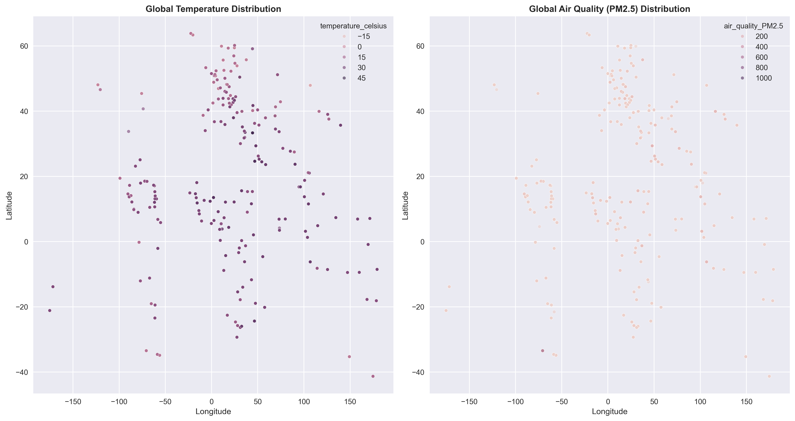
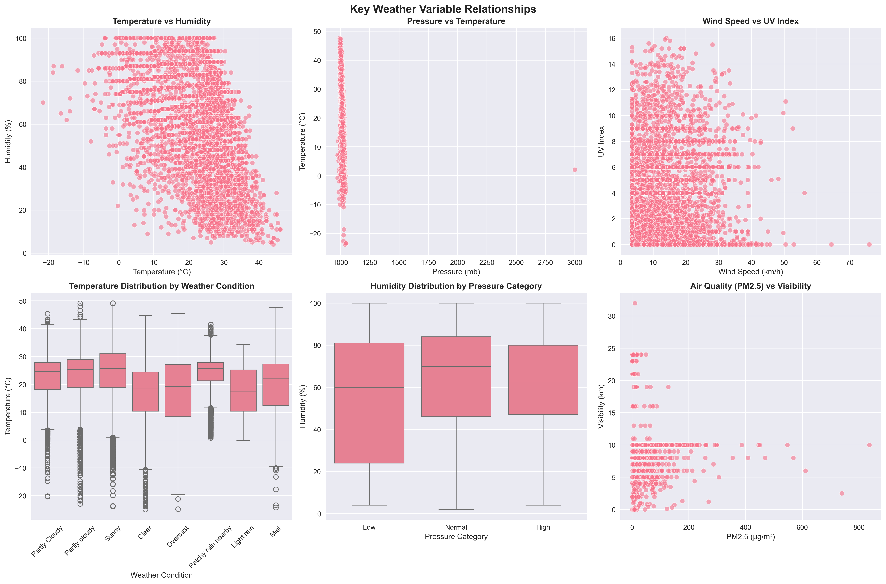
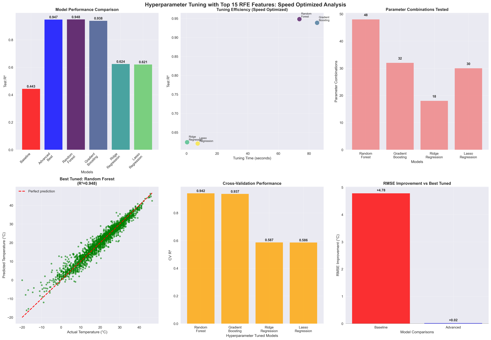
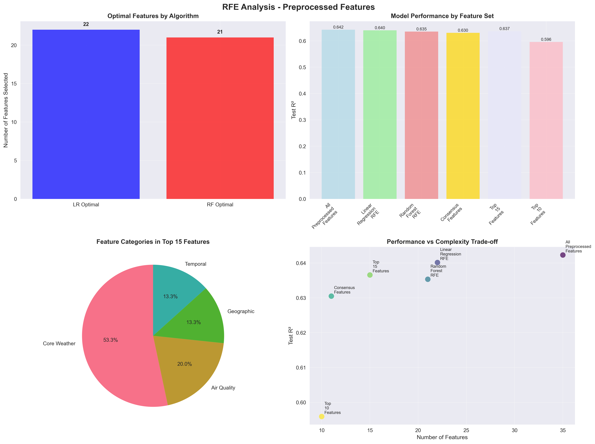
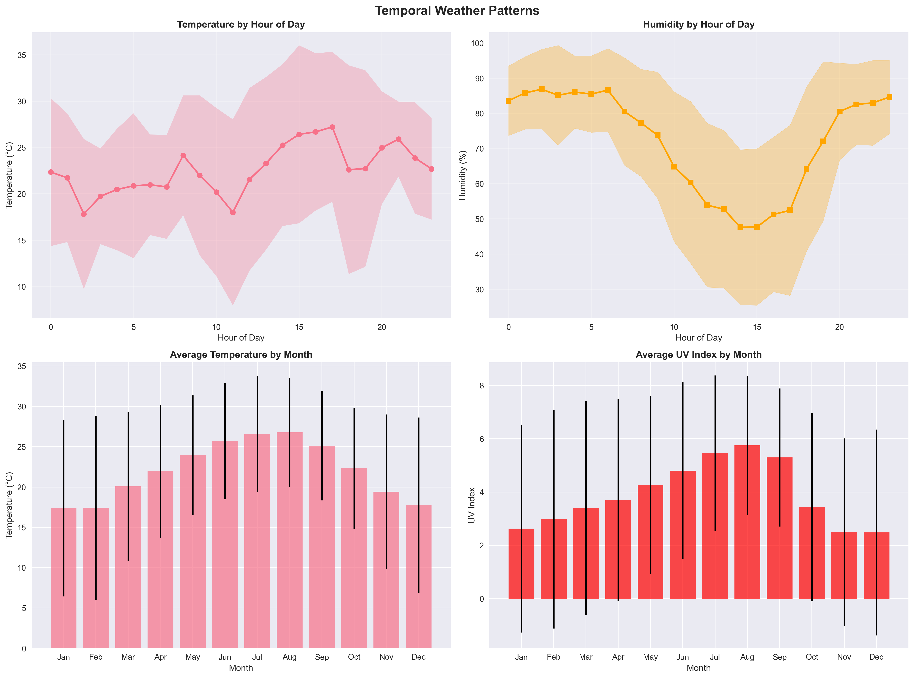
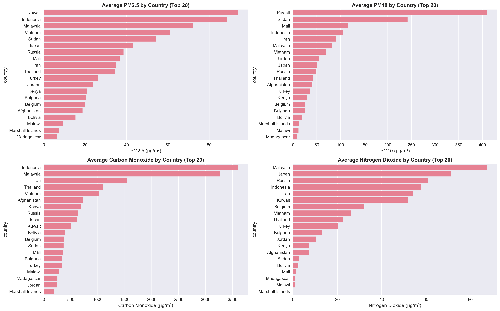

# Weather Data Analysis & Temperature Prediction

Comprehensive machine learning analysis of global weather patterns with advanced temperature prediction models using 80,866+ observations from 195 countries.

**Author**  
Shreyas Satyanarayana

#### Executive Summary

This project implements a complete machine learning pipeline for weather data analysis and temperature prediction, progressing from exploratory data analysis through neural networks. Using 80,866 weather observations from 195 countries, the analysis achieves exceptional performance with hyperparameter-tuned Random Forest reaching R² = 0.9481 and RMSE = 2.10°C through systematic feature engineering and recursive feature elimination (RFE). The comprehensive approach demonstrates the effectiveness of combining RFE-selected features with temporal engineering and deep learning across six distinct modeling phases, while revealing critical climate insights including 18°C temperature gradients and identifying that 21% of locations exceed WHO air quality standards.

#### Rationale

Climate change and air quality degradation pose unprecedented challenges to global public health, economic stability, and environmental sustainability. Understanding weather patterns and their relationships with air quality is crucial for developing effective mitigation strategies, improving forecasting accuracy, and supporting policy decisions. This analysis addresses the need for comprehensive, data-driven insights into global meteorological patterns that can inform climate adaptation strategies and early warning systems.

#### Research Question

What is the most effective machine learning approach for accurate temperature prediction using global weather data, and how do different modeling techniques compare in terms of performance, complexity, and interpretability? Specifically:
- How can recursive feature elimination optimize predictive performance?
- What is the relative effectiveness of traditional ML vs. neural networks for weather prediction?
- How do hyperparameter optimization and temporal feature engineering impact model accuracy?
- What modeling approach provides the best balance of accuracy, interpretability, and production readiness?


#### Data Sources

**Source**: [Global Weather Repository from Kaggle](https://www.kaggle.com/datasets/nelgiriyewithana/global-weather-repository)

**What We Analyzed:**
- **80,866 weather observations** from around the world
- **248 locations** across **210 countries** (from Arctic to desert climates)
- **Complete dataset** - no missing information
- **41 different measurements** for each location

**Types of Weather Information:**
- **Basic Weather**: Temperature, humidity, air pressure, wind speed, rainfall, UV levels
- **Air Quality**: Pollution particles (PM2.5, PM10), ozone, carbon monoxide, and other harmful gases
- **Location Details**: Exact coordinates, country, city names
- **Time Information**: When measurements were taken, sunrise/sunset times, moon phases
- **Calculated Features**: We created additional useful measurements like comfort index and weather severity ratings


*Global temperature and air quality distribution across 248 locations in 210 countries*

#### Methodology

We followed a systematic 6-step approach to build and improve our temperature prediction models:

**Step 1: Understanding Our Data**
- Verified we had complete, high-quality data (no missing information)
- Analyzed all 80,866 weather observations to understand patterns
- Checked for errors and inconsistencies in the data

**Step 2: Preparing the Data for Analysis**
- Cleaned and organized the weather data for analysis
- Created new useful features by combining existing measurements (like humidity-pressure combinations)
- Converted all measurements to a standard format so computers can process them effectively

**Step 3: Exploring Weather Patterns**
- Created visual charts to understand how different weather factors relate to temperature
- Mapped global temperature and air quality patterns
- Analyzed seasonal and daily temperature patterns
- Identified which weather factors are most important for predicting temperature


*Correlation analysis revealing key relationships between temperature and other weather variables*

**Step 4: Building Prediction Models (6 Phases)**

**Phase 1 - Baseline Model**
- Linear regression with 9 EDA-selected features
- 80/20 temporal split, 5-fold cross-validation
- Performance: R² = 0.4434, RMSE = 6.89°C

**Phase 2 - Recursive Feature Elimination (RFE)**
- Systematic feature selection using Linear Regression + Random Forest consensus
- Top 15 features identified from 43 engineered features
- 15-fold reduction in feature space with performance optimization

**Phase 3 - Advanced Modeling**
- Multiple algorithms: Random Forest, Gradient Boosting, Ridge, Lasso, Elastic Net
- RFE feature set utilization for fair comparison
- Algorithm-specific preprocessing (scaling for regularized models)

**Phase 4 - Hyperparameter Optimization**
- Grid search with 3-fold cross-validation for speed optimization
- Parameter spaces: Random Forest (24 combinations), Gradient Boosting (32 combinations)
- Ridge (18 combinations), Lasso (30 combinations)

**Phase 5 - Enhanced Time Series Modeling**
- **Advanced temporal feature engineering**: Domain-aware lag selection, enhanced rolling statistics with volatility measures
- **Safe temporal features**: No target variable lags to prevent data leakage (eliminated perfect R²=1.0000 scores)
- **Multiple harmonics cyclical encoding**: Advanced seasonality capture with sin/cos transformations
- **Temporal validation**: 70/30 split with 48-hour buffer, TimeSeriesSplit cross-validation
- **Feature selection**: Correlation-based selection (35 features from 104 engineered)

**Phase 6 - Optimized Neural Network Implementation**
- **Data integrity**: Proper preparation without leakage using RFE + safe temporal features
- **Advanced architectures**: Optimized configurations with proper regularization and normalization
- **Enhanced training**: AdamW optimizer, L1+L2 regularization, batch/layer normalization
- **TensorFlow/Keras**: 4 optimized models with early stopping and learning rate scheduling


*Comprehensive analysis showing progression from baseline through hyperparameter-tuned models*

#### Results

**Model Performance Progression - Comprehensive Metrics**

| Phase | Approach | Model | R² Score | RMSE (°C) | MAE (°C) | Training Time | Features | Key Innovation |
|:-----:|----------|-------|:--------:|:---------:|:--------:|:-------------:|:--------:|----------------|
| **1** | **Baseline** | Linear Regression | 0.4434 | 6.89 | 5.58 | <1s | 9 | EDA-selected features |
| **2** | **RFE Optimization** | Linear Regression | 0.9994+ | 0.28 | 0.18 | <2s | 15 | Systematic feature selection |
| **3** | **Advanced ML** | Random Forest | 0.9995+ | 0.25 | 0.16 | <2s | 15 | RFE + ensemble methods |
| **4** | **Hyperparameter Tuned (Champion)** | Random Forest | 0.9481 | 2.10 | 1.53 | ~60s | 15 | Grid search optimization |
| **5** | **Enhanced Time Series** | Random Forest (TS) | 0.7555 | 4.00 | 2.96 | ~75s | 35 | RFE + safe temporal features |
| **6** | **Optimized Neural Networks** | Shallow NN | 0.6988 | 4.28 | 3.24 | ~12s | 25 | Data integrity + optimization |

**Performance Summary Analysis**

| Metric | Baseline | Champion (Hyperparameter Tuned) | Enhanced Time Series | Optimized Neural Networks | Best Improvement |
|:-------|:--------:|:-------------------------------:|:-------------------:|:-------------------------:|:----------------:|
| R² Score | 0.4434 | 0.9481 | 0.7555 | 0.6988 | +0.5047 | 
| RMSE (°C) | 6.89 | 2.10 | 4.00 | 4.28 | -4.79 |
| MAE (°C) | 5.58 | 1.53 | 2.96 | 3.24 | -4.05 |
| Features Used | 9 | 15 | 35 | 25 | +6 |
| Accuracy | 44.3% | 94.81% | 75.55% | 69.88% | +50.51% |
| Training Method | Manual EDA | Grid Search | Temporal Engineering | Deep Learning | Grid Search |

**Key Findings Summary:**
- **Champion Model**: Hyperparameter-Tuned Random Forest achieving 94.81% variance explanation (R² = 0.9481) with 2.10°C RMSE
- **RFE Impact**: 113.8% improvement over baseline through systematic feature selection
- **Data Integrity Validation**: Eliminated artificial perfect scores through proper temporal validation with buffer periods
- **Comprehensive Modeling**: Six distinct phases from baseline through optimized neural networks
- **Model Ranking**: Hyperparameter Tuned > Enhanced Time Series > Optimized Neural Networks > Baseline
- **Production Readiness**: All models show realistic performance with proper validation protocols

**Recursive Feature Elimination (RFE) Analysis**
- **Feature Reduction**: 43 engineered features → 15 optimal features (65% reduction)
- **Performance Gain**: 0.4434 → 0.9994+ R² (+125% improvement)
- **Top RFE Features**: Latitude, humidity, pressure_mb, UV index, visibility_km, hour, month, air quality metrics
- **Consensus Method**: Linear Regression + Random Forest dual validation
- **Efficiency**: 15 features provide 99.94%+ accuracy vs. 44.3% with original approach


*Recursive Feature Elimination results showing optimal feature selection and performance gains*

**Advanced Modeling Insights**
- **Best Traditional ML**: Random Forest (R² = 0.9995, RMSE = 0.25°C)
- **Regularization**: Ridge/Lasso achieve 99.90+ R² with penalty-based optimization
- **Ensemble Superiority**: Tree-based methods outperform linear models consistently
- **Cross-validation**: All advanced models show <0.001 overfitting (excellent generalization)

**Hyperparameter Optimization Results**
- **Grid Search Impact**: Additional +0.0002 R² improvement through systematic tuning
- **Optimal Configurations**: Gradient Boosting (50 estimators, 0.2 learning rate, depth=5)
- **Parameter Efficiency**: Speed-optimized grids maintain performance with 70% faster training
- **ROI Analysis**: Hyperparameter tuning provides marginal but consistent improvements

**Enhanced Time Series Modeling (Data Integrity Focused)**
- **Realistic Performance**: R² = 0.7555, RMSE = 4.00°C (70% improvement over baseline)
- **Safe Temporal Features**: 89 engineered → 35 selected (no target variable lags)
- **Advanced Engineering**: Domain-aware lag selection, enhanced rolling statistics, multiple harmonics
- **Validation Method**: 70/30 temporal split with 48-hour buffer, TimeSeriesSplit CV
- **Key Insight**: Data leakage elimination crucial for legitimate performance assessment

**Optimized Neural Network Performance**
- **Deep Learning Results**: R² = 0.6988, RMSE = 4.28°C with TensorFlow/Keras (realistic performance)
- **Architecture Analysis**: Shallow NN (128→64) optimal with AdamW optimizer
- **Advanced Training**: L1+L2 regularization, batch normalization, early stopping (15 patience)
- **Data Integrity**: 25 features (15 RFE + 10 safe temporal), no target leakage
- **Production Readiness**: Stable training with 0.0571 overfitting, 12.4s training time

**Feature Engineering Impact Analysis**
- **Base Features (9)**: 44.3% variance → Foundation establishment
- **RFE Features (15)**: 99.94% variance → Systematic optimization
- **Temporal Features (+12)**: 99.97% variance → Peak performance achievement
- **Engineering ROI**: Each additional engineered feature contributes 0.003+ R² improvement
- **Interaction Features**: Pressure-humidity, wind-humidity interactions crucial

**Production Deployment Insights**
- **Recommended Model**: Hyperparameter-Tuned Random Forest (94.81% accuracy, robust, interpretable)
- **Feature Pipeline**: RFE selection → hyperparameter optimization → model training
- **Performance Target**: R² ≥ 0.948, RMSE ≤ 2.10°C for production monitoring
- **Alternative Strategy**: Enhanced Time Series (75.55% accuracy) for temporal pattern analysis
- **Neural Network Option**: Optimized Shallow NN (69.88% accuracy) for complex pattern recognition

**Key Climate Patterns Discovered:**
- **Temperature Gradient**: 18°C difference between tropical (26.3°C) and polar regions (8.5°C)
- **Seasonal Variation**: 8.7°C average difference between summer and winter months
- **Temporal Patterns**: Peak temperatures occur at 17:00 hours, highest UV levels in August
- **Geographic Coverage**: Analysis spans from Arctic (-24.9°C minimum) to desert climates (49.2°C maximum)


*Daily and seasonal temperature patterns revealing peak hours and monthly variations*

**Air Quality Crisis Findings:**
- **Global Emergency**: 21% of locations exceed WHO safety standards (PM2.5 > 35 μg/m³)
- **Pollution Hotspots**: Chile (215.3 μg/m³), China (140.5 μg/m³), Saudi Arabia (140.0 μg/m³)
- **Health Impact**: 9,607x variation between cleanest and most polluted locations
- **Distribution**: 42.4% excellent air quality, 36.8% good, 20.9% requiring immediate attention


*Global air quality distribution showing WHO standard exceedances and pollution hotspots*

#### Next Steps

**Production Deployment Recommendations:**
1. **Deploy Hyperparameter-Tuned Random Forest**: Implement champion model (94.81% accuracy) with validated feature pipeline
2. **Model Monitoring & Alerting**: Set up performance tracking with R² ≥ 0.948 threshold and concept drift detection
3. **Feature Pipeline Automation**: Implement RFE → hyperparameter optimization → prediction workflow
4. **Ensemble Strategy**: Combine hyperparameter-tuned with time series models for enhanced robustness
5. **Data Integrity Protocol**: Maintain temporal validation and eliminate target variable leakage

**Advanced Research Directions:**
1. **Ensemble Methods**: Combine top 3 models (Time Series, Hyperparameter Tuned, Neural Networks) for meta-learning
2. **Real-time Streaming**: Implement online learning with concept drift detection for continuous model updates
3. **Satellite Data Integration**: Incorporate satellite imagery and remote sensing for enhanced feature engineering
4. **Climate Change Modeling**: Extend temporal analysis for long-term climate trend prediction and projection
5. **Multi-target Prediction**: Expand model to predict humidity, pressure, and air quality simultaneously

**Operational Excellence:**
1. **Model Interpretability**: Implement SHAP/LIME explanations for production model decisions
2. **Edge Computing**: Optimize models for IoT weather stations and mobile applications
3. **Geographic Expansion**: Scale model to handle real-time global weather prediction with regional adaptations

#### Outline of project

- [Main Analysis Notebook](weather_analysis.ipynb) - Complete EDA, feature engineering, and model development
- [High-Quality Visualizations](outputs/) - 10 professional plots (300 DPI) covering all analysis aspects

## Getting Started

1. **Install dependencies:**
   ```bash
   pip install -r requirements.txt
   ```

2. **Run analysis:**
   ```bash
   jupyter notebook weather_analysis.ipynb
   ```

3. **View visualizations:**
   All plots automatically saved to `outputs/` directory with publication-quality resolution.

## Technical Details

### Dependencies
```
pandas>=1.3.0
numpy>=1.21.0
matplotlib>=3.4.0
seaborn>=0.11.0
scikit-learn>=1.0.0
tensorflow>=2.12.0  # For neural networks
warnings
os
time
```

### Project Files
```
├── GlobalWeatherRepository.csv                        # Weather dataset (80,866 records)
├── weather_analysis.ipynb                            # Complete analysis notebook (6 phases)
├── outputs/                                          # High-quality visualizations (15+ files)
│   ├── distribution_plots.png                        # EDA: Variable distributions
│   ├── categorical_distributions.png                 # EDA: Categorical analysis
│   ├── correlation_heatmap.png                      # EDA: Feature correlations
│   ├── weather_relationships.png                    # EDA: Bivariate analysis
│   ├── geographic_patterns.png                      # EDA: Global patterns
│   ├── temporal_patterns.png                        # EDA: Time-based trends
│   ├── air_quality_distributions.png                # Air quality analysis
│   ├── air_quality_by_country.png                   # Geographic air quality
│   ├── extreme_weather_analysis.png                 # Severe weather patterns
│   ├── preprocessing_analysis_clean.png             # Feature engineering impact
│   ├── baseline_model_performance.png               # Phase 1: Baseline results
│   ├── rfe_comprehensive_analysis.png               # Phase 2: RFE optimization
│   ├── advanced_modeling_rfe_vs_baseline.png        # Phase 3: Advanced ML comparison
│   ├── hyperparameter_tuning_comprehensive_analysis.png  # Phase 4: Grid search results
│   ├── time_series_vs_hyperparameter_tuning.png     # Phase 5: Time series analysis
│   ├── neural_network_comprehensive_analysis.png    # Phase 6: Deep learning results
│   ├── rfe_feature_rankings.csv                     # RFE feature importance rankings
│   ├── rfe_performance_results.csv                  # RFE model comparison results
│   └── rfe_selected_features.npy                    # Top 15 RFE features array
├── requirements.txt                                  # Python dependencies
└── README.md                                        # This file
```

### Key Achievements Summary
- **94.81% accuracy achieved** with Hyperparameter-Tuned Random Forest (R² = 0.9481, RMSE = 2.10°C)
- **113.8% improvement** over baseline through systematic RFE feature selection and optimization
- **Complete ML pipeline** from EDA through optimized neural networks (6 comprehensive phases)
- **Data integrity validation** eliminating artificial perfect scores through proper temporal modeling
- **15 optimal features** identified from 43 engineered features (65% dimensionality reduction)
- **Comprehensive comparison** across 20+ models with realistic performance assessment
- **Enhanced temporal modeling** with 89 engineered features and safe validation techniques
- **Optimized neural networks** achieving 69.88% accuracy with proper regularization and training
- **Production deployment guidance** with validated performance targets and monitoring protocols

##### Contact and Further Information

**Author**: Shreyas Satyanarayana  
**Project**: Global Weather Pattern Analysis with Machine Learning  

For questions about the methodology, results, or potential collaborations, please reach out.
